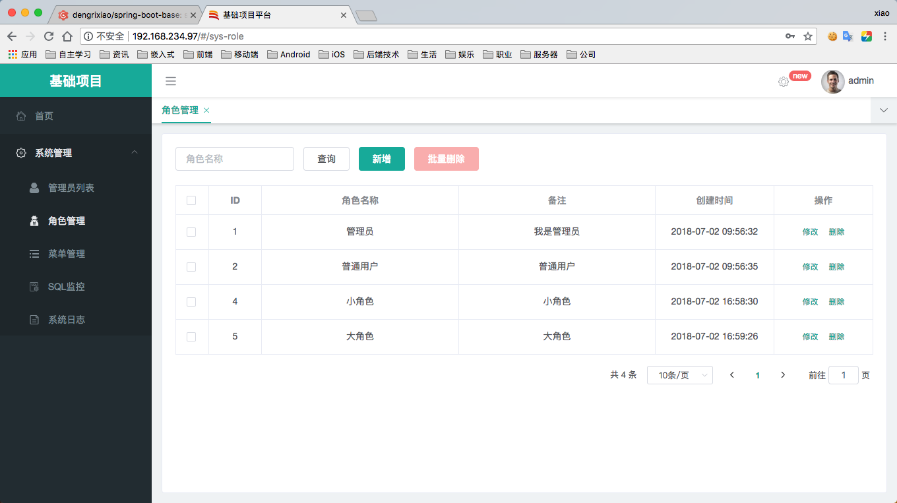
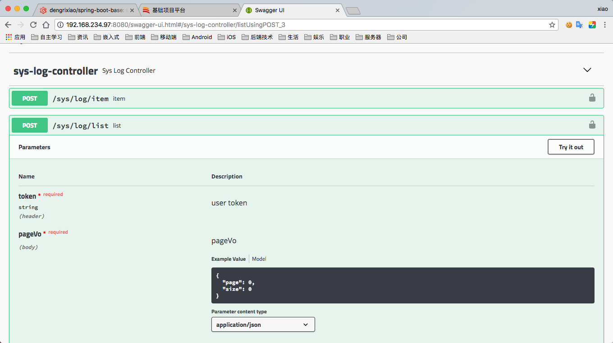
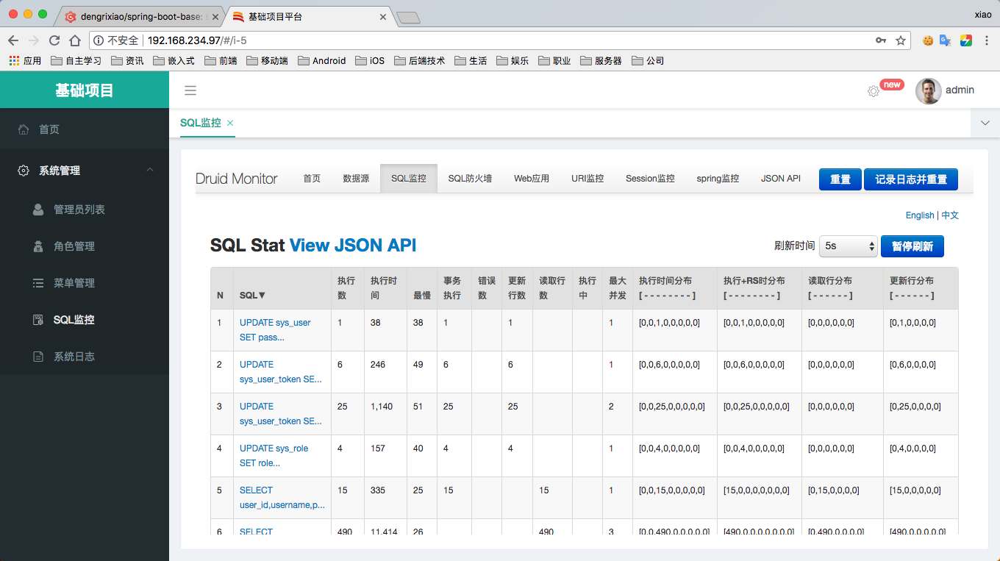

# spring-boot-base

基于Spring boot + Mybatis 的后台基础框架。

# 技术选型

|序号|框架|说明
|---|---|---
|1. |Spring Boot|MVC框架 
|2. |MyBatis|ORM框架
|3. |MySQL|数据库
|4. |tk.mybatis|MyBatis 辅助框架
|5. |pagehelper|分页框架
|6. |shiro|权限框架
|7. |druid|数据库连接池
|8. |fastjson|Json序列化框架
|9. |swagger|API框架
|10. |hutool|工具类框架


# 框架特性

1. 友好的代码结构及注释，便于阅读及二次开发。
2. 实现前后端分离，通过token进行数据交互。
3. 完善的代码生成机制，可在线生成po、xml、dao、service代码，减少50%以上的开发任务
4. `lombok`使用，简化model类的get和set等生成方法.
5. `Controller`使用`@RestController`接口返回json.
6. `@Valid`控制参数限制。
7. `@RequestBody`传入参。
8. 使用`@SysLogger`进行系统操作日志记录（切面实现）。
9. 统一异常返回处理。
10. 使用`tk.mybatis`简化MyBatis的框架代码。
11. `shiro`安全框架使用，基于token的登录，认证等权限控制。
12. 灵活的权限控制，可控制到页面或按钮，满足绝大部分的权限需求。
13. 基于`BRAC`(基于角色访问控制)的安全架构设计。
14. 基于`swagger`实现在线后端接口文档。
15. maven 命令一键部署测试环境。

# 项目结构

```
spring-boot-base

├─db  项目SQL语句
│
├─config 项目配置模块
│  ├─FilterConfig   过滤器配置
│  ├─ShiroConfig    Shiro配置
│  └─WebMvcConfig   Json配置和跨域配置
│ 
├─core  项目核心模块
│  ├─annotation     注解配置
│  ├─aspect         切面配置
│  ├─exception      全局异常配置
│  ├─oauth2         权限配置
│  ├─result         统一返回配置
│  └─util           工具类
│  
├─dao       dao层
├─dto       dto层
├─po        po层
├─service   service层
├─web       controller层
│ 
├─SpringBootBaseApplication 项目启动类
│  
├──resources 
│  ├─mapper SQL对应的XML文件
│  └─static 静态资源

```


# 开发规范

1. 基于框架特性进行接口开发。
2. 错误返回基本采取抛异常处理方式（`ServiceException`）。
3. 与前端进行接口联调时，或测试接口时以swagger为准，实时且高效。
4. po层为数据库映射对象，dto层为数据传输对象，po对象在dao中使用，dto在controller中使用，po与dto在service中交互。
5. controller层只调用各service，不调用dao层mapper。
6. 包名为全小写。各层命名下，增加业务模块分类包名。
7. po层对象命名使用数据库表名的大驼峰法
8. dao层类命名：po层对象+Mapper
8. service层类命名：po层对象+Service（不加前缀"I",没有意义），实现类命名：service层类+Impl
9. controller层类命名：po层对象+Controller
10. dto层类命名：po层对象+Dto


## 演示环境

### 1.前端界面

http://192.168.234.97/



### 2.后台接口

http://192.168.234.97:8080/swagger-ui.html



### 3.sql监控

http://192.168.234.97:8080/druid/sql.html



# 简单使用

## 1.Redis 使用

查看`SysRedisTest`单元测试，使用Redis进行数据缓存。

```java
@RunWith(SpringRunner.class)
@SpringBootTest
public class SysRedisTest {

    @Autowired
    private RedisUtils redisUtils;

    @Test
    public void redisSetAndGet() {
        String uuid = "1234";
        SysCaptcha sysCaptcha1 = new SysCaptcha();
        sysCaptcha1.setCode("asdfq");
        sysCaptcha1.setUuid(uuid);
        sysCaptcha1.setExpireTime(new Date());
        // 设置值
        redisUtils.set(RedisKeys.getSysCaptchaKey(uuid), sysCaptcha1);
        // 取值验证
        SysCaptcha sysCaptcha2 = redisUtils.get(RedisKeys.getSysCaptchaKey(uuid), SysCaptcha.class);
        Assert.assertEquals(sysCaptcha1.getCode(), sysCaptcha2.getCode());
    }

    @Test
    public void redisDelete() {
        String uuid = "1234";
        // 删除
        redisUtils.delete(RedisKeys.getSysCaptchaKey(uuid));
        // 验证删除
        SysCaptcha sysCaptcha = redisUtils.get(RedisKeys.getSysCaptchaKey(uuid), SysCaptcha.class);
        Assert.assertNull(sysCaptcha);
    }
}
```

## 2.一键远程部署

### 2.1 pom配置

1.在`pom.xml`文件中配置远程数据库相关环境参数，及ssh登录账号和密码。

```xml
<!-- wagon plugin 配置 -->
<service-path>/opt/www/sinocare-base</service-path>
<java-home>/opt/software/jdk1.8.0_171/bin</java-home>
<pack-name>${project.artifactId}.jar</pack-name>
<remote-addr>192.168.234.97:22</remote-addr>
<remote-username>root</remote-username>
<remote-passwd>123456</remote-passwd>
```

2.在`pom.xml`插件中可查看具体命令，基本不用做修改。

```xml
<!-- wagon 远程部署 -->
<plugin>
	<!-- 运行命令 mvn clean package wagon:upload-single wagon:sshexec -->
	<groupId>org.codehaus.mojo</groupId>
	<artifactId>wagon-maven-plugin</artifactId>
	<version>1.0</version>
	<configuration>
		<fromFile>target/${pack-name}</fromFile>
		<url><![CDATA[scp://${remote-username}:${remote-passwd}@${remote-addr}${service-path}]]></url>
		<commands>
			<!-- Kill 旧线程，如果没有旧线程，注释掉此句 -->
			<!--<command><![CDATA[kill -9 `ps -ef |grep ${project.artifactId}.jar|grep -v "grep" |awk '{print $2}'`]]></command>-->
			<!-- nohup 启动进程并写入日志到 spring-boot-base.log -->
			<command><![CDATA[nohup ${java-home}/java -jar ${service-path}/${pack-name} --spring.profiles.active=test > ${service-path}/spring-boot-base.log 2>&1 & ]]></command>
			<!-- 查看服务器端口 -->
			<command><![CDATA[netstat -nptl]]></command>
			<!-- 查看服务器进程 -->
			<command><![CDATA[ps -ef | grep java | grep -v grep]]></command>
		</commands>
		<displayCommandOutputs>true</displayCommandOutputs>
	</configuration>
</plugin>
```

3.执行maven命令进行上传到运程服务器，并进行部署。

```
mvn clean package wagon:upload-single wagon:sshexec
```


## 3.一键CRUD代码生成

1.在单元测试包中，配置`ProjectConstant` 和 `CodeGenerator` 进行相关的工程配置及数据库配置。

`ProjectConstant`中进行相关项目常量配置：

```
/**
 * 项目常量
 */
public final class ProjectConstant {
    public static final String BASE_PACKAGE = "com.sinocare.base";          //项目基础包名称，根据自己公司的项目修改
    public static final String BUSINESS_PACKAGE = ".sys";                  // 业务模块名

    public static final String MODEL_PACKAGE = BASE_PACKAGE + ".po" + BUSINESS_PACKAGE;            //po所在包
    public static final String MAPPER_PACKAGE = BASE_PACKAGE + ".dao" + BUSINESS_PACKAGE;          //Mapper所在包
    public static final String SERVICE_PACKAGE = BASE_PACKAGE + ".service" + BUSINESS_PACKAGE;     //Service所在包
    public static final String SERVICE_IMPL_PACKAGE = BASE_PACKAGE + ".service" + ".impl" + BUSINESS_PACKAGE;   //ServiceImpl所在包
    public static final String CONTROLLER_PACKAGE = BASE_PACKAGE + ".web" + BUSINESS_PACKAGE;      //Controller所在包

    public static final String MAPPER_INTERFACE_REFERENCE = BASE_PACKAGE + ".core.MyMapper";//Mapper插件基础接口的完全限定名
}
```

`CodeGenerator`中进行数据库及项目相关信息配置：

```
//JDBC配置，请修改为你项目的实际配置
private static final String JDBC_URL = "jdbc:mysql://118.178.189.178:3306/mydb";
private static final String JDBC_USERNAME = "xxx";
private static final String JDBC_PASSWORD = "xxx@sino178";
private static final String JDBC_DIVER_CLASS_NAME = "com.mysql.jdbc.Driver";

private static final String PROJECT_PATH = System.getProperty("user.dir");//项目在硬盘上的基础路径
private static final String TEMPLATE_FILE_PATH = PROJECT_PATH + "/src/test/resources/template";//模板位置

private static final String JAVA_PATH = "/src/main/java"; //java文件路径
private static final String RESOURCES_PATH = "/src/main/resources";//资源文件路径

private static final String PACKAGE_PATH_SERVICE = packageConvertPath(SERVICE_PACKAGE);//生成的Service存放路径
private static final String PACKAGE_PATH_SERVICE_IMPL = packageConvertPath(SERVICE_IMPL_PACKAGE);//生成的Service实现存放路径
private static final String PACKAGE_PATH_CONTROLLER = packageConvertPath(CONTROLLER_PACKAGE);//生成的Controller存放路径

private static final String AUTHOR = "jeikerxiao";//@author
private static final String DATE = new SimpleDateFormat("yyyy/MM/dd").format(new Date());//@date
```


2.`CodeGenerator`中的main方法为代码生成入口，填写入数据库表名，执行，可生成相关代码。

```java
public static void main(String[] args) {
    genCode("sys_captcha");
//        genCode("输入表名");
    //genCodeByCustomModelName("输入表名","输入自定义Model名称");
}
```

在命令终端查看生成代码的日志。

## 4. 国际化

1.在资源文件夹中 `resources/i18n` 中配置属性和对应语言的翻译。

例如：messages_ja.properties （后缀的_ja表示语言，要符合标准）

```
# 日语
hello.world=こんにちは
```

2.使用，注入`MessageSourceService` 使用`getMessage`方法获取属性值。

```java
@Autowired
private MessageSourceService messageSourceService;

@ApiOperation("测试国际化")
@GetMapping("/test")
public Result test() {
    String msg = messageSourceService.getMessage("hello.world");
    log.info("hello.world = {}", msg);
    return ResultUtil.success(msg);
}
```

3.同时可查看单元测试中的 `SysI18nTest` 查看并测试使用。